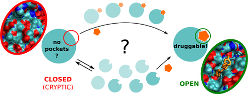
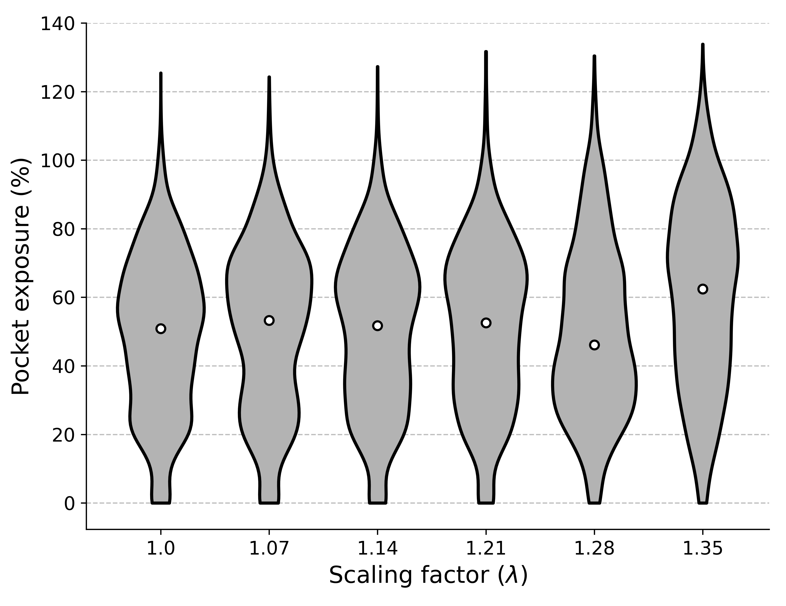

<p align="center">
  
</p>

# SWISH-X bootcamp

This project contains the files needed to set up a SWISH-X simulation for TEM-1 β-lactamase and a tutorial for the analysis. We will be working with the same data presented in https://doi.org/10.1101/2023.11.03.565527.  

## Getting started
### Quick summary of the method (SWISH-X)
What is SWISH-X? 

SWISH-X (SWISH Expanded, https://doi.org/10.1101/2023.11.03.565527) is our latest cryptic pocket sampling strategy that combines SWISH (Sampling Water Interfaces through Scaled Hamiltonians, https://pubs.acs.org/doi/10.1021/jacs.6b05425) with OPES MultiThermal (https://doi.org/10.1103/PhysRevX.10.041034). SWISH-X is a Hamiltonian Replica Exchange-based method developed by our group to explore hidden ("cryptic") ligand binding sites in proteins. By progressively scaling the non-bonded interactions of solvent molecules with apolar (carbon and sulphur) protein atoms, SWISH-X shifts the water properties towards more ligand-like behaviour to increase the opening of cryptic sites. The higher the value of the scaling factor λ, the stronger the water affinity for apolar protein surface patches. Additionaly, to help overcoming the free energy barriers associated with cryptic pocket formation, SWISH-X, via OPES MultiThermal, allows the system to effectively sample a selected temperature range, in a way similar to simulated tempering techniques.

SWISH-X can be used in two different ways, a validation mode and a discovery mode. The validation mode is typically used to sample known cryptic sites, whereas the discovery mode is typically used to sample new cryptic sites in the structure of a protein. The setup of a SWISH simulation is virtually identical in both cases.
### Prerequisites

- a working installation of GROMACS patched with PLUMED. To check what the latest PLUMED-patchable GROMACS version is, see https://www.plumed.org/doc 

- a reasonably recent Python distribution (tested with 3.9.12)

- stride, for secondary structure assignment. Installation instructions are available at http://webclu.bio.wzw.tum.de/stride/install.html. Alternatively, stride can be used via a web server at: http://webclu.bio.wzw.tum.de/cgi-bin/stride/stridecgi.py

## TEM-1 β-lactamase
TEM-1 β-lactamase is considered a model system for the detection and characterisation of cryptic pockets. Here we focus on the opening of a cryptic pocket in the structure of TEM-1 β-lactamase, previously validated by crystallography. We have selected two different TEM-1 β-lactamase structures, an apo (PDB ID: 1JWP) and a holo (PDB ID: 1PZO), and we will see how we can get a good sample of the selected cryptic pocket using SWISH-X. A detailed example of how to set up and run a SWISH-X simulation for TEM-1 β-lactamase follows.

### Step 1: Structure selection
For this example we will use the apo TEM-1 β-lactamase structure from the PDB entry 1jwp. We have N-capped and protonated the system at pH 7.4, any preparation protocol will work as long as the naming is force field consistent and you are confident of the final results. Here we used des-amber-SF1.0.ff, available at https://github.com/paulrobustelli/Force-Fields.

### Step 2: Unbiased MD simulation
To get a better idea of how the system will behave and to eliminate false positives, it is always a good idea to run a good old vanilla, extensive unbiased MD simulation. The data from this simulation will also help us later when setting the AT value for the restraint on the contact map (see step 4 for more details). Here we ran a 1 &mu;s simulation in the NPT ensemble with GROMACS 2022.3 and the des-amber-SF1.0.ff force field.
A more detailed (and general) protocol for setting up and running an MD simulation can be found at: http://www.mdtutorials.com/gmx/lysozyme/index.html.

### Step 3: Probe selection and parametrisation
In this example we have used benzene as a molecular probe to aid sampling of the target cryptic pocket. The parameterisation of organic molecules is typically done using programs such as Gaussian.
To run  with organic probes as mixed solvent, we need a set of files containing the parameters of the chosen organic probe, i.e. `benzene.gro`, `benzene.itp`, `benzene_atypes.itp` and `benzene_nbonded.itp`. These files will later be included in the modified topologies for . The content of each file is as follows:

 - `benzene.gro`: benzene structure file
 - `benzene.itp`: GROMACS topology file for benzene
 - `benzene_atypes.itp`: atom types for benzene
 - `benzene_nbonded.itp`: nonbonded parameters for intermolecular repulsive potentials, used to avoid phase separation

### Step 4: Generate the contact map
In order to prevent unfolding, we recommend (strongly recommend) to set an upper wall restraint on the value of the protein's contact map. Here we have included a script that conveniently generates a plumed formatted contact map file. The example below shows how this is typically done:
 
4a.Generate reference pdb and gro files for your protein structure. In this example we have used the energy minimised TEM-1 β-lactamase from pdb 1JWP:
```
    gmx trjconv -f 1jwp_min.gro -o 1jwp_cmap.pdb -s em.tpr

    gmx trjconv -f 1jwp_min.gro -o 1jwp_cmap.gro -s em.tpr
```
NOTE: `1jwp_cmap.pdb` should only contain protein atoms.

4b. Generate the secondary structure stride file with stride:
```
    stride 1jwp_cmap.pdb > 1jwp_stride.txt
```
4c. Generate the PLUMED cmap.dat file using the python script provided:
```
    python contact_map_generator.py -f 1jwp_cmap.gro -s 1jwp_stride.txt -com 0 0 0 -include 0-290 -o 1jwp_cmap.dat
```
NOTE:  Here we have included all the residues in the contact map. If the location of the pocket is known, it is usually a better idea to define the pocket centre with -com and exclude the residues around this area (default 0.6 nm) from the contact map.

### Step 5: Set the upper wall restraint
As mentioned above, setting an upper wall value for the contact map should prevent unfolding, but at the same time we don't want to be too strict and force the protein into its initial conformation. To avoid this, we can calculate the value of the contact map along the unbiased MD simulation (step 2). We can then set the AT value in our `plumed.dat` file to be higher than the maximum values observed in the unbiased MD. We will use this .dat file in our SWISH-X simulation later. This should prevent complete unfolding of the protein, but still allow enough flexibility to sample the opening of cryptic pockets. In PLUMED this can be done with the following command:
```
    plumed driver --plumed driver_at.dat --mf_xtc 1jwp_unbiased.xtc 

```
where `driver_at.dat` looks something like this:
```
######################
#plumed.dat for SWISH#
######################
#RESTART
#####################
### AT CMAP CHECK ###
#####################
MOLINFO STRUCTURE=./1jwp_cmap.pdb
INCLUDE FILE=./1jwp_cmap.dat
WHOLEMOLECULES STRIDE=1 ENTITY0=1-4066

PRINT ARG=* STRIDE=10 FILE=AT_COLVAR FMT=%8.4f
```
### Step 6: Include probes
We can use GROMACS to include the target concentration of benzene molecules into our simulation box. In this example we will have a final benzene concentration of 1 M. We can start from the neutralised structure file (`1jwp_ions.gro`) that we generated for the unbiased MD (step 2):
```
gmx insert-molecules -f 1jwp_ions.gro -o 1jwp_benz.gro -ci benzene.gro -nmol 215 -replace SOL
```
The number of benzene molecules to be added to reach the target molar concentration x (1 in this example) can be calculated using the following formula:


$$ probes = \frac{(6.023 \cdot 10^{23} \cdot x \cdot 29.94A^3 \cdot waters)}{10^{27} A^3} $$

and the number of water molecules (SOL) can be obtained from the previously generated topology (Step 2, `1jwp_ions.top`):
```
[ molecules ]
; Compound        #mols
Protein_chain_A     1
SOL         11940
NA               43
CL               36
```
Now we can generate a `1jwp_benz.top` file for `1jwp_benz.gro` by simply editing the number of SOL molecules after adding 215 benzene molecules. The final `1jwp_benz.top` after the edit looks like this:
```
[ molecules ]
; Compound        #mols
Protein_chain_A     1
SOL         10820
NA               43
CL               36
BNZ              215
```
Finally, we need to include the `benzene.itp` and the other files created during the probe parameterisation (step 3) in `1jwp_benz.top`:
```
; Include forcefield parameters
#include "../des-amber.ff/forcefield.itp"
#include "benzene_atypes.itp"

; include repulsion terms
#include "benzene_nbonded.itp"

; Include topology for fragments
#include "benzene.itp"
```
### Step 7: Generate SWISH-X topologies
We can now generate the scaled SWISH-X topologies by simply running:
```
gmx grompp -pp 1jwp_swish.top -p 1jwp_benz.top -f nvt.mdp -c 1jwp_benz.gro -n 1jwp_benz.ndx -r 1jwp_benz.gro

python SWISH_GMX_general_v2.py -f 1jwp_swish.top -smin 1 -smax 1.35 -carbonyl C -nreps 8
```
NOTE: You can include position restraints directly into the SWISH-X topologies by passing a .mdp file containing the `define = -DPOSRES` line to `gmx grompp` and including the corresponding `posre.itp` file in the folder where `gmx grompp` is run. Please remember to add the `#ifdef POSRES` and `#endif` clauses to your topologies. 
```
#ifdef POSRES
[ position_restraints ]
; atom  type      fx      fy      fz
     2     1  1000  1000  1000
     5     1  1000  1000  1000
     6     1  1000  1000  1000
                  ...
  4064     1  1000  1000  1000
  4065     1  1000  1000  1000
  4066     1  1000  1000  1000
#endif 
```
## Step 8: OPES MultiThermal
We can now specify the temperature range we want to explore with the SWISH-X simulation. To do this, we simply need to add an OPES EXPANDED term to our plumed file:
```
######################
#plumed.dat for SWISH#
######################
#RESTART
#####################
### RESTRAINT CMAP ###
#####################
MOLINFO STRUCTURE=./1jwp_cmap.pdb
INCLUDE FILE=./1jwp_cmap.dat
WHOLEMOLECULES STRIDE=1 ENTITY0=1-4066
uwall: UPPER_WALLS ARG=cmap AT=30 KAPPA=500.0 EXP=2 EPS=1 # Upper Wall (restraint_4_swish)
#################################
######### DEFINE_OPES_EXPANDED ###
##################################
ene: ENERGY
ecv: ECV_MULTITHERMAL ARG=ene TEMP_MAX=350
opesX: OPES_EXPANDED ARG=ecv.* FILE=DeltaFs.data PACE=5000

PRINT ARG=* STRIDE=1000 FILE=COLVAR FMT=%8.4f
```
Here we are effectively sampling a temperature range from the selected thermostat temperature (300 K) up to 350 K. We update the OPES EXPANDED bias every 5000 steps. It is important to check how the exploration of the potential energy progresses along the simulation, an example of a desired profile can be found in the Supplementary Figure 2 at https://doi.org/10.1101/2023.11.03.565527. More detailed information on the OPES EXPANDED action can be found at https://www.plumed.org/doc-v2.8/user-doc/html/_o_p_e_s__e_x_p_a_n_d_e_d.html. 

## Step 9: Run SWISH-X
A convenient folder structure for running SWISH looks like this:
```
tem1_swishX
 ┣ rep_0
 ┃ ┗ 1jwp_swishx0.top
 ┣ rep_1
 ┃ ┗ 1jwp_swishx1.top
 ┣ rep_2
 ┃ ┗ 1jwp_swishx2.top
 ┣ rep_3
 ┃ ┗ 1jwp_swishx3.top
 ┣ rep_4
 ┃ ┗ 1jwp_swishx4.top
 ┣ rep_5
 ┃ ┗ 1jwp_swishx5.top
 ┃ 
 ┣ 1jwp_benz.gro
 ┣ 1jwp_benz.ndx
 ┣ 1jwp_cmap.dat
 ┣ 1jwp_cmap.pdb
 ┣ 1jwp_swishX.sh
 ┣ em.mdp
 ┣ npt.mdp
 ┣ npt2.mdp
 ┣ nvt.mdp
 ┣ plumed.dat
 ┗ prod.mdp
```
All of these files can be found in the `swishX_files` folder. Note that the `1jwp_swish.sh` file will have to be modified according to the architecture you are running the simulations on, it is provided here as an example. The AT value of the UPPER_WALLS in the PLUMED file was set as described in Step 5.

## Analysis of the results
We will now show how our SWISH-X simulation successfully exposes the main cryptic pocket of TEM-1 β-lactamase.
To do this, we will use Mdpocket to monitor the volume of the cryptic pocket along the different replicas of the SWISH-X simulation and compare these results with those obtained from the unbiased MD simulation. 
First we need to generate a PDB with dummy atoms to delineate the pocket. We can do this by running Mdpocket on the TEM-1 β-lactamase holo structure 1PZO. In this PDB entry, the cryptic pocket is in its open conformation and accommodates a ligand. The Mdpocket command is:
```
mdpocket --pdb_list pdb_list_file
```
where `pdb_list_file` is a text file containing the path to the PDB file 1PZO.
We can then select and save (in PDB format) the pocket of interest with pymol by visualing the output file `mdpout_freq_iso_0_5.pdb`. 
We can now use this PDB file, namely `1pzo_refpock.pdb`, to monitor the volume of this pocket along different simulations of the TEM-1 β-lactamase apo structure 1JWP. First, we run Mdpocket on each SWISH-X replica. Here is an example for replica 0:
```
mdpocket --trajectory_file rep_0/1jwp_swishX_r0.xtc --trajectory_format xtc -f 1jwp_ref_pdb --selected_pocket 1pzo_refpock.pdb
```
And we can do the same for the unbiased MD trajectory:
```
mdpocket --trajectory_file 1jwp_unbiased.xtc --trajectory_format xtc -f 1jwp_ref_pdb --selected_pocket 1pzo_refpock.pdb
```
NOTE: All the trajectories must be aligned to the same reference structure. This reference structure has to be aligned to the structure (1PZO) used to obtain `1pzo_refpock.pdb` (see fpocket manual for more details).

We can now plot the resulting descriptor files to visualise the volume of the pocket along the different trajectories:
<p align="center">
  
</p>

## Authors and acknowledgements
- Alberto Borsatto
- Eleonora Gianquinto
- Valerio Rizzi
- Francesco Luigi Gervasio
