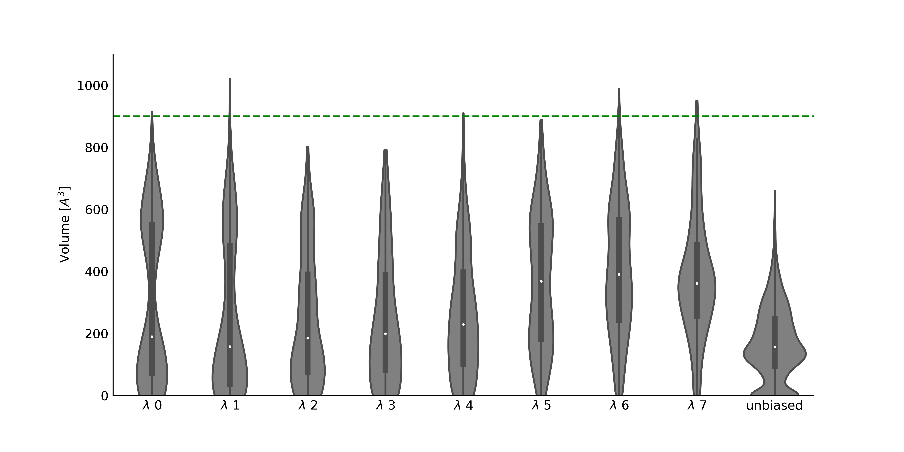

<p align="center">
  
</p>

# SWISH bootcamp

This project contains the files required to setup a SWISH simulation, along with an example project (TEM-1 β-lactamase) and a guide for analysis.

## Getting started
### Quick summary of the method (SWISH)
Repetita iuvant:
What is SWISH?
SWISH (Sampling Water Interfaces through Scaled Hamiltonians, https://pubs.acs.org/doi/10.1021/jacs.6b05425) is a Hamiltonian Replica Exchange-based method. SWISH simulations combined with organic probes were shown to be a robust general approach for cryptic site discovery. By progressively scaling the nonbonded interactions of solvent molecules with apolar (carbon and sulfur) protein atoms, SWISH shifts the water properties toward more ligand-like behavior to increase cryptic site opening. The higher the value of scaling factor λ, the stronger the water affinity for apolar protein surface patches.
SWISH can be used in two different ways, a validation mode and a discovery mode. The validation mode is typically done to sample known cryptic sites whereas the discovery mode is typically employed to sample new cryptic sites in a protein's structure. The setup of a SWISH simulation is virtually identical in both cases.

### Prerequisites

- A working installation of GROMACS patched with PLUMED. To check what is the latest PLUMED-patchable GROMACS version please refer to https://www.plumed.org/doc 

- A reasonably recent Python distribution (tested with 3.9.12)

- stride, for secondary structure assignment. Installation guide is available at: http://webclu.bio.wzw.tum.de/stride/install.html. Alternatively, stride can also be used via webserver at: http://webclu.bio.wzw.tum.de/cgi-bin/stride/stridecgi.py

## TEM-1 β-lactamase
TEM-1 β-lactamase is considered a model system for cryptic pocket detection and characterization. Here we will focus on the opening of a cryptic pocket in the structure of TEM-1 β-lactamase that was previously validated by crystallography. We selected two different TEM-1 β-lactamase structures, one apo (PDB:1jwp) and one holo (PDB:1pzo), and we will see how we can get a good sampling of the selected cryptic pocket employing SWISH. A detailed example project on how to set up and run a SWISH simulation for TEM-1 β-lactamase follows.

### Step 1: Structure selection
For this example we will use the apo TEM-1 β-lactamase structure from the PDB entry 1jwp. We N-capped and protonated the system at a pH of 7.4, any preparation protocol works as long as the naming is force field consistent and you are confident about the final results. Here we used des-amber-SF1.0.ff, available at https://github.com/paulrobustelli/Force-Fields.

### Step 2: Unbiased MD simulation
To get a better idea of how the system behaves and exclude false positives it is always a good move to run a good old, vanilla, extensive unbiased MD simulation. The data from this simulation will also help us later in setting the AT value for the bias on the contact map (see Step 4 for more details). Here we ran a 1 &mu;s simulation in the NVT ensemble with GROMACS 2021.3 and the des-amber-SF1.0.ff force field.
For a more detailed (and general) protocol on how to setup and run a MD simulation refer to: http://www.mdtutorials.com/gmx/lysozyme/index.html.

### Step 3: Probe selection and parametrisation
In this example we used benzene as a molecular probe to help the sampling of the target cryptic pocket. The parametrisation of organic molecules is typically done with programs such as Gaussian. Please refer to this tutorial for more details: 
At the end of the day, to run SWISH with organic probes as mixed solvent, we need a set of files containing the parameters of the chosen organic probe, i.e. `benzene.gro`, `benzene.itp`, `benzene_atypes.itp` and `benzene_nbonded.itp`. These files will be later included in the modified topologies for SWISH. The content of each file is the following:
 - `benzene.gro`: benzene structure file
 - `benzene.itp`: GROMACS topology file for benzene
 - `benzene_atypes.itp`: atom types for benzene
 - `benzene_nbonded.itp`: nonbonded parameters for intermolecular repulsive potentials, used to avoid phase separation

### Step 4: Generate contact map
In order to prevent unfolding, we recommend (strongly recommend) to set an upper wall for the value of the reference contact map. Here we included a script that conveniently generates a plumed formatted contact map file. The example below shows how this is typically done:
 
4a. Generate reference pdb and gro files for your protein's structure. In this example we used the energy minimised TEM-1 β-lactamase from pdb 1JWP:
```
    gmx trjconv -f 1jwp_min.gro -o 1jwp_cmap.pdb -s em.tpr

    gmx trjconv -f 1jwp_min.gro -o 1jwp_cmap.gro -s em.tpr
```
NOTE: `1jwp_cmap.pdb` should contain only protein atoms.

4b. Generate the secondary structure stride file with stride:
```
    stride 1jwp_cmap.pdb > 1jwp_stride.txt
```
4c. Create the PLUMED cmap.dat file using the provided python script:
```
    python contact_map_generator.py -f 1jwp_cmap.gro -s 1jwp_stride.txt -com 0 0 0 -include 0-290 -o 1jwp_cmap.dat
```
NOTE: Here we included all the residues in the contact map. If the pocket location is known it is usually a better idea to define the pocket center with -com and exclude the residues around that area (default 0.6 nm) from the contact map. 

### Step 5: Set upper wall 
As mentioned above, setting an upper wall value for the contact map should prevent unfolding but, at the same time, we don't want to be too stringent and force the protein to its initial conformation. To avoid that, we can calculate the value of the contact map along the unbiased MD simulation (step 2). We can then set the AT value in our `plumed.dat` file to be higher than the maximum values observed in the unbiased MD, we will use this .dat file in our SWISH simulation later. Doing so, we should be able to prevent the complete unfolding of the protein but still allow enough flexibility to sample the opening of cryptic pockets. With PLUMED this can be done with the following command:
```
    plumed driver --plumed driver_at.dat --mf_xtc 1jwp_unbiased.xtc 

```
where `driver_at.dat` looks something like this:
```
######################
#plumed.dat for SWISH#
######################
#RESTART
#####################
### AT CMAP CHECK ###
#####################
MOLINFO STRUCTURE=./1jwp_cmap.pdb
INCLUDE FILE=./1jwp_cmap.dat
WHOLEMOLECULES STRIDE=1 ENTITY0=1-4066

PRINT ARG=* STRIDE=10 FILE=AT_COLVAR FMT=%8.4f
```
### Step 6: Include probe
We can use GROMACS to include the target concentration of benzene molecules in our system. In this example we will have a final benzene concentration of 1 M. We can start from the neutralised structure file (`1jwp_ions.gro`) that we generated for the unbiased MD (step 2):
```
gmx insert-molecules -f 1jwp_ions.gro -o 1jwp_benz.gro -ci benzene.gro -nmol 215 -replace SOL
```
The number of benzene molecules to add to reach the target molar concentration x (1 in this example) can be calculated with the following formula:

```math
probes = \frac{(6.023 \cdot 10^{23} \cdot x \cdot 29.94A^3 \cdot waters)}{10^{27} A^3}
```
and the number of water molecules (SOL) can be obtained from the previously generated topology (Step 2, `1jwp_ions.top`):
```
[ molecules ]
; Compound        #mols
Protein_chain_A     1
SOL         11940
NA               43
CL               36
```
Now we can generate a `1jwp_benz.top` file for `1jwp_benz.gro` by simply editing the number of SOL molecules after the addtion of 215 benzene molecules. The final `1jwp_benz.top` after the edit looks like this:
```
[ molecules ]
; Compound        #mols
Protein_chain_A     1
SOL         10820
NA               43
CL               36
BNZ              215
```
Finally, we have to include in `1jwp_benz.top` the `benzene.itp` and other files generated during the probe parametrisation (Step 3):
```
; Include forcefield parameters
#include "../des-amber.ff/forcefield.itp"
#include "benzene_atypes.itp"

; include repulsion terms
#include "benzene_nbonded.itp"

; Include topology for fragments
#include "benzene.itp"
```
### Step 7: Generate SWISH topologies
We can now generate the scaled SWISH topologies by simply running:
```
gmx grompp -pp 1jwp_swish.top -p 1jwp_benz.top -f nvt.mdp -c 1jwp_benz.gro -n 1jwp_benz.ndx -r 1jwp_benz.gro

python SWISH_GMX_general_v2.py -f 1jwp_swish.top -smin 1 -smax 1.35 -carbonyl C -nreps 8
```
NOTE: You can include position restraints directly into the SWISH topologies by passing a .mdp file containing the `define = -DPOSRES` line to `gmx grompp` and including the corresponding `posre.itp` file in the folder where `gmx grompp` is run. Please remeber to add the `#ifdef POSRES` and `#endif` clauses to your topologies. 
```
#ifdef POSRES
[ position_restraints ]
; atom  type      fx      fy      fz
     2     1  1000  1000  1000
     5     1  1000  1000  1000
     6     1  1000  1000  1000
                  ...
  4064     1  1000  1000  1000
  4065     1  1000  1000  1000
  4066     1  1000  1000  1000
#endif 
```
## Step 8: Run SWISH
A convenient folder structure for running SWISH looks like this:
```
tem1_swish
 ┣ rep_0
 ┃ ┗ 1jwp_swish0.top
 ┣ rep_1
 ┃ ┗ 1jwp_swish1.top
 ┣ rep_2
 ┃ ┗ 1jwp_swish2.top
 ┣ rep_3
 ┃ ┗ 1jwp_swish3.top
 ┣ rep_4
 ┃ ┗ 1jwp_swish4.top
 ┣ rep_5
 ┃ ┗ 1jwp_swish5.top
 ┣ rep_6
 ┃ ┗ 1jwp_swish6.top
 ┣ rep_7
 ┃ ┗ 1jwp_swish7.top
 ┣ 1jwp_benz.gro
 ┣ 1jwp_benz.ndx
 ┣ 1jwp_cmap.dat
 ┣ 1jwp_cmap.pdb
 ┣ 1jwp_swish.sh
 ┣ em.mdp
 ┣ npt.mdp
 ┣ npt2.mdp
 ┣ nvt.mdp
 ┣ plumed.dat
 ┗ prod.mdp
```
All of these files can be found in the `swish_files` folder. Note that the `1jwp_swish.sh` file will have to be modified according to the architecture you are running the simulations on, it is provided here as an example. The AT value of the UPPER_WALLS in the PLUMED file was set as described in Step 5.

## Analysis of the results
We will show here how the sampling with SWISH helped in opening a known cryptic pocket in the TEM-1 β-lactamase apo structure 1JWP.
To do so, we will employ Mdpocket to monitor the volume of the cryptic pocket along the different replicas of the SWISH simulations and compare these results with the ones obtained from the unbiased MD simulation. 
First we have to generate a PDB containing dummy atoms to delimit the pocket. We can do that by running Mdpocket on the TEM-1 β-lactamase holo structure 1PZO. In this PDB entry, the cryptic pocket is in its open conformation and accommodates a ligand. The Mdpocket command is:
```
mdpocket --pdb_list pdb_list_file
```
where `pdb_list_file` is a text file containing the path to the PDB file 1PZO.
We can then select and save (in PDB format) the pocket of interest with pymol visualing the output file `mdpout_freq_iso_0_5.pdb`. 
We can now use this PDB file, namely `1pzo_refpock.pdb`, to monitor the volume of this pocket along different simulations of the TEM-1 β-lactamase apo structure 1JWP. First, we run Mdpocket on each SWISH replica. Here is an example for replica 0:
```
mdpocket --trajectory_file rep_0/1jwp_swish_r0.xtc --trajectory_format xtc -f 1jwp_ref_pdb --selected_pocket 1pzo_refpock.pdb
```
And we can do the same for the unbiased MD trajectory:
```
mdpocket --trajectory_file 1jwp_unbiased.xtc --trajectory_format xtc -f 1jwp_ref_pdb --selected_pocket 1pzo_refpock.pdb
```
NOTE: All the trajectories must be aligned to the same reference structure. This reference structure has to be aligned to the structure (1PZO) used to obtain `1pzo_refpock.pdb` (See fpocket manual for more details).

We can now plot the resulting descriptor files to visualise the volume of the pocket along the different trajectories:



## Authors and acknowledgment
- Vladas Oleinikovas
- Havva Yalinca
- Antonija Kuzmanic
- Federico Comitani
- Ladislav Hovan
- Alberto Borsatto
- Martijn Pieter Bemelmans
- Francesco Luigi Gervasio
